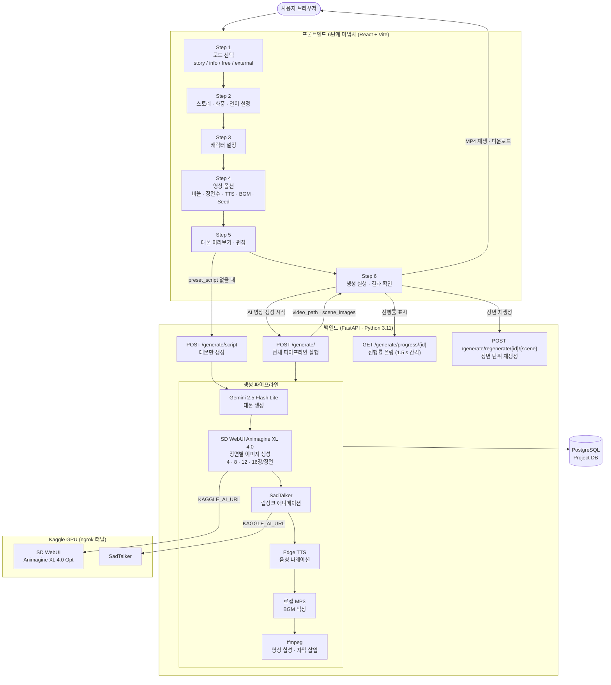

# Fable — AI 쇼츠 영상 자동 생성기

프롬프트 하나로 대본 → 이미지 → 립싱크 → TTS → BGM → 자막까지 자동으로 합성해 쇼츠 영상을 만드는 풀스택 AI 앱.

---

## 작동 흐름



---

## 기술 스택

| 영역 | 사용 기술 |
|------|-----------|
| 백엔드 | Python 3.11 · FastAPI · PostgreSQL · SQLAlchemy |
| 프론트엔드 | React 18 · Vite 6 · i18next (한/영/일/중) |
| 대본 AI | Gemini 2.5 Flash Lite (`google-genai`) |
| 이미지 AI | SD WebUI · Animagine XL 4.0 Opt (Kaggle GPU) |
| 립싱크 | SadTalker (Kaggle GPU) |
| TTS | Edge TTS |
| BGM | 로컬 MP3 / 사용자 업로드 |
| 영상 합성 | ffmpeg |
| GPU 터널 | ngrok → `KAGGLE_AI_URL` |

---

## 주요 환경변수 (`.env`)

```
KAGGLE_AI_URL=   # Fable_AI_v2.ipynb ngrok URL
GEMINI_API_KEY=  # Google AI Studio
GEMINI_MODEL=gemini-2.5-flash-lite
NGROK_TOKEN=     # ngrok 인증 토큰
```

---

## 실행 방법

```bash
# 백엔드
cd server
.\venv\Scripts\activate
python -m uvicorn main:app --reload --port 8000

# 프론트엔드
cd web
npm run dev          # http://localhost:5173
```

> Kaggle 노트북(`fable-ai-v2.ipynb`)을 먼저 실행하고 ngrok URL을 `KAGGLE_AI_URL`에 입력해야 이미지·립싱크 생성이 활성화됩니다.

---

## API 엔드포인트

| 메서드 | 경로 | 설명 |
|--------|------|------|
| `POST` | `/generate/script` | 대본만 생성 (Step 5 미리보기) |
| `POST` | `/generate/` | 전체 파이프라인 실행 |
| `GET` | `/generate/progress/{id}` | 진행률 폴링 |
| `POST` | `/generate/regenerate/{id}/{scene}` | 장면 단위 재생성 |
| `GET` | `/audio/kaggle/status` | Kaggle 서버 연결 상태 |
| `POST` | `/audio/bgm/upload` | BGM 파일 업로드 |

---

## 현재 진행 상태

| 항목 | 상태 |
|------|------|
| FastAPI 백엔드 (라우터 · 서비스 전체) | ✅ 완료 |
| React 6단계 스텝 마법사 UI | ✅ 완료 |
| Gemini 대본 생성 (story / info / free / external 모드) | ✅ 완료 |
| SD WebUI 이미지 생성 (Kaggle 연동, seed 고정) | ✅ 완료 |
| SadTalker 립싱크 + ffmpeg fallback | ✅ 완료 |
| Edge TTS 나레이션 | ✅ 완료 |
| BGM 로컬 선택 / 파일 업로드 | ✅ 완료 |
| ffmpeg 영상 합성 · 자막 삽입 | ✅ 완료 |
| 장면 단위 재생성 | ✅ 완료 |
| 다국어 지원 (한/영/일/중) | ✅ 완료 |
| E2E 테스트 (전체 플로우 검증) | ⏳ 진행 중 |
| 시연 영상 제작 | ⏳ 미완료 |
