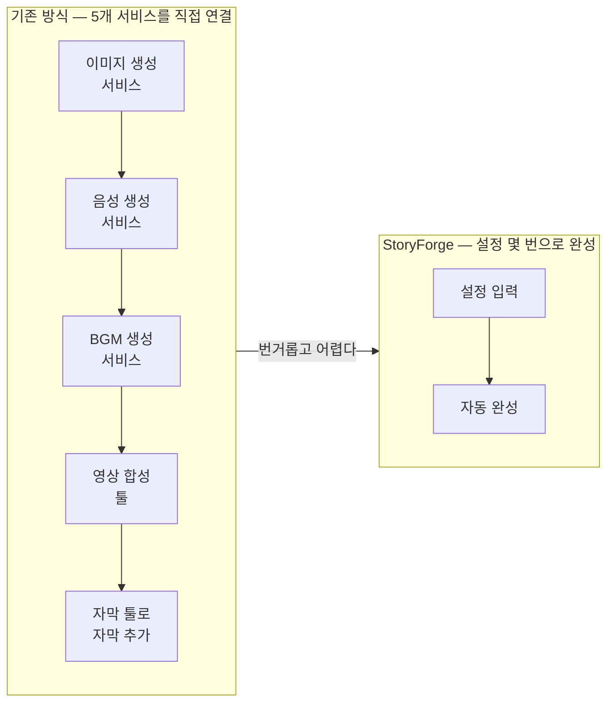
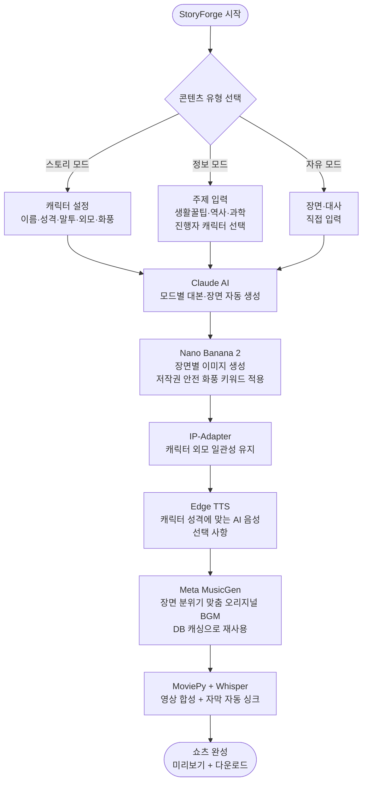
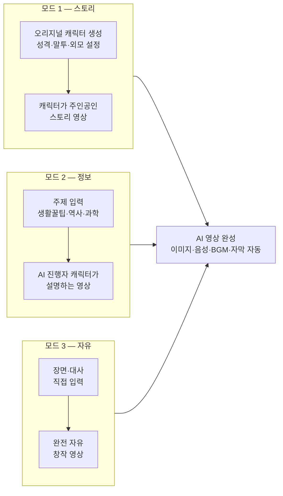
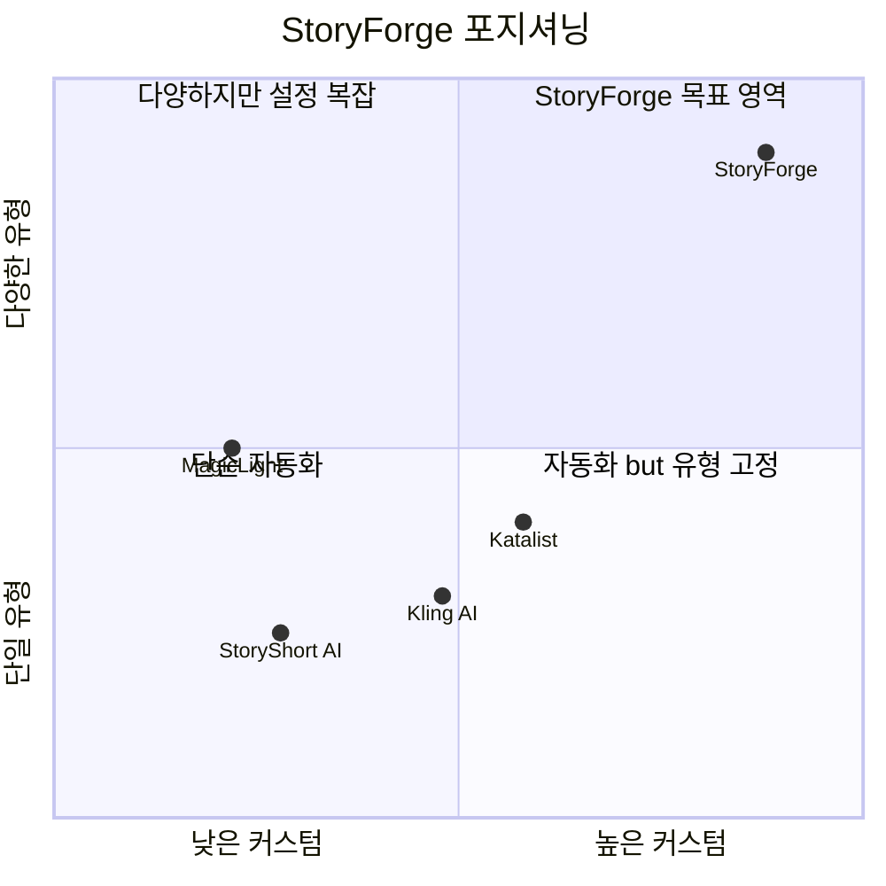
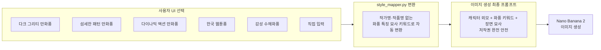
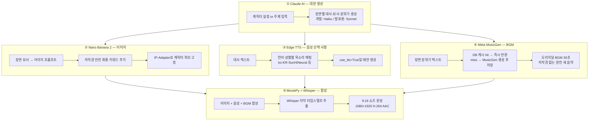
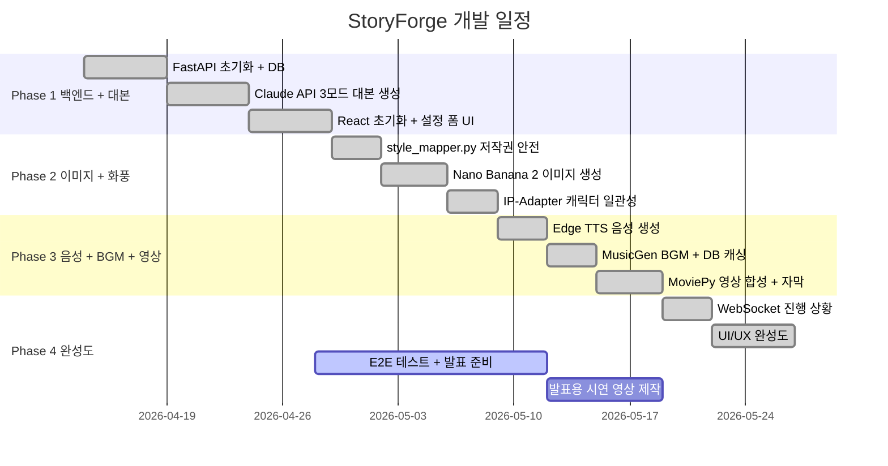

# StoryForge
> **스토리든, 정보든, 내 스타일대로 — AI가 영상으로 만든다**

어떤 유형의 AI 영상이든 설정 몇 번으로 완성까지 한 번에.
스토리 창작, 정보 콘텐츠, 자유 영상 — 하나의 앱에서 전부 가능하다.

---

## 한 줄 핵심

> **"기존에 AI 영상 하나 만들려면 5개 서비스를 써야 했다. StoryForge는 그걸 하나로 합쳤다."**

---

## 기존 서비스의 문제

**문제 1 — 유형이 고정되어 있다**
StoryShort는 자동 쇼츠만, Katalist는 스토리보드만. 스토리도 정보 콘텐츠도 한 앱에서 되는 서비스가 없다.

**문제 2 — 파이프라인이 쪼개져 있다**
이미지·음성·BGM·합성을 각각 다른 서비스에서 직접 연결해야 한다.

---

## StoryForge 작동 원리

---

## 3가지 콘텐츠 모드

**스토리 모드 활용 예시**
- 내가 만든 판타지 캐릭터의 모험 쇼츠
- 다크 그리티 화풍 오리지널 크로스오버 창작
- 귀여운 캐릭터의 일상 웹툰 쇼츠

**정보 모드 활용 예시**
- 고양이 캐릭터가 알려주는 생활 꿀팁 채널
- AI 박사 캐릭터의 역사·과학 지식 쇼츠
- 요리 캐릭터의 레시피 팁

---

## 시중 서비스와의 차별점

| 기능 | StoryForge | StoryShort | Katalist | MagicLight |
|------|:----------:|:----------:|:--------:|:----------:|
| 스토리형 영상 | ✅ | ✅ | ⚠️ | ✅ |
| 정보형 영상 | ✅ | ❌ | ❌ | ⚠️ |
| 주인공 없는 진행자형 | ✅ | ❌ | ❌ | ❌ |
| 오리지널 캐릭터 설정 | ✅ | ❌ | ⚠️ | ❌ |
| 캐릭터 성격→대사 반영 | ✅ | ❌ | ❌ | ❌ |
| 캐릭터 외모 일관성 | ✅ | ❌ | ✅ | ❌ |
| 화풍 스타일 선택 | ✅ | ❌ | ❌ | ❌ |
| AI BGM 생성 | ✅ | ❌ | ❌ | ❌ |
| 완전 자동 + 커스텀 동시 | ✅ | ❌ | ❌ | ❌ |
| 전체 파이프라인 통합 | ✅ | ⚠️ | ❌ | ⚠️ |
| 저작권 안전 설계 | ✅ | ⚠️ | ⚠️ | ⚠️ |

---

## 화풍 스타일 시스템 (저작권 안전)

**저작권 안전 원칙**

| UI 표시 | 이미지 프롬프트 (저작권 안전) |
|---------|--------------------------|
| 다크 그리티 만화풍 | `dark gritty manga style, rough bold linework, heavy shadows, intense expression` |
| 섬세한 패턴 만화풍 | `detailed decorative pattern background, soft gradient shading, flowing motion lines` |
| 다이나믹 액션 만화풍 | `dynamic action linework, high contrast, dramatic camera angle, speed lines` |
| 한국 웹툰풍 | `webtoon style, korean manhwa, full color, soft pastel, modern setting` |
| 감성 수채화풍 | `watercolor illustration, soft brush strokes, pastel palette, dreamy atmosphere` |

작가 이름·작품명·캐릭터명은 프롬프트에 절대 포함하지 않는다.
화풍의 시각적 특징만 묘사하는 키워드만 사용한다.

---

## AI 파이프라인 상세

---

## 기술 스택

| 분류 | 기술 | 역할 | 비용 |
|------|------|------|------|
| 프론트엔드 | React + Vite | 웹 UI | $0 |
| 백엔드 | FastAPI (Python) | REST API + WebSocket | $0 |
| 대본 생성 | Claude API (Haiku→Sonnet) | 스토리·정보·자유 3가지 모드 대본 | ~$0.40 |
| 이미지 생성 | Nano Banana 2 (Gemini 3.1 Flash Image) | 장면별 이미지 + 화풍 스타일, 애니풍 특화 | ~$1.61 |
| 캐릭터 일관성 | IP-Adapter (오픈소스) | 장면마다 동일한 캐릭터 외모 유지 | $0 |
| 음성 생성 | Microsoft Edge TTS | 캐릭터 성격별 AI 음성, API 키 불필요 | $0 |
| BGM 생성 | Meta MusicGen + DB 캐싱 | 장면 분위기 맞춤 오리지널 BGM, 로컬 실행 | $0 |
| 영상 합성 | MoviePy + ffmpeg | 이미지+음성+BGM → 최종 영상 | $0 |
| 자막 | Whisper (로컬) | 음성 타임스탬프 추출 → 자막 싱크 | $0 |
| DB | PostgreSQL + SQLAlchemy | 프로젝트·설정·BGM 캐시 저장 | $0 |
| **총합** | | | **~$2 (약 3천원)** |

> **Claude 모델 전략** — 개발/테스트 중 `claude-haiku-4-5-20251001` 사용, 발표용 최종 영상 생성 시 `claude-sonnet-4-6` 으로 교체

---

## 개발 로드맵

---

## 저작권 안전 설계 요약

StoryForge는 처음부터 저작권 침해가 불가능한 구조로 설계되어 있다.

모든 이미지는 Nano Banana 2로 새로 생성하며 기존 이미지를 복제하지 않는다.
화풍 스타일은 작가명·작품명 없이 시각적 특징을 묘사하는 키워드만 사용한다.
BGM은 Meta MusicGen으로 생성하는 완전 오리지널 음악이며 로컬에서 실행된다.
음성은 Microsoft Edge TTS로 생성하며 기존 성우·가수의 목소리를 복제하지 않는다.

---

## 발표 시연 시나리오

**시연 1 — 스토리 모드**
"파란 단발, 겁쟁이 마법사, 다크 그리티 만화풍, 판타지 코믹" 입력
→ AI가 캐릭터 성격이 반영된 8장면 스토리 생성
→ 모든 장면에서 동일한 캐릭터 등장 (IP-Adapter 효과 확인)
→ 캐릭터 말투에 맞는 AI 음성 + 오리지널 BGM
→ 자막 포함 쇼츠 완성

**시연 2 — 정보 모드**
"전자레인지 꿀팁 5가지, 귀여운 고양이 진행자" 입력
→ AI가 5개 팁을 장면으로 나눠 대본 생성
→ 귀여운 캐릭터가 설명하는 정보 영상 완성
→ 캐릭터 없이도 완성된 콘텐츠 채널 영상 제작 가능
