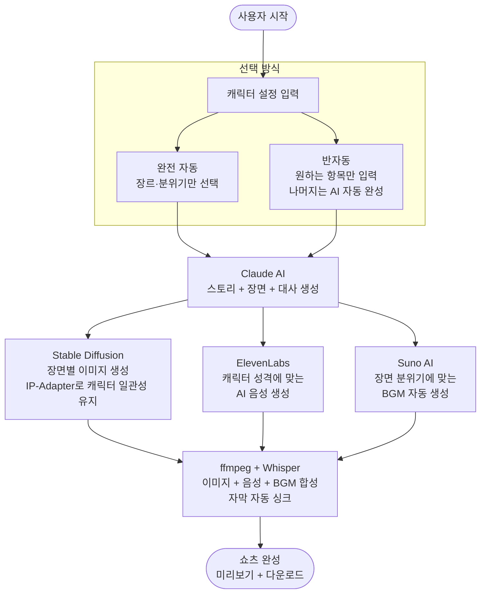
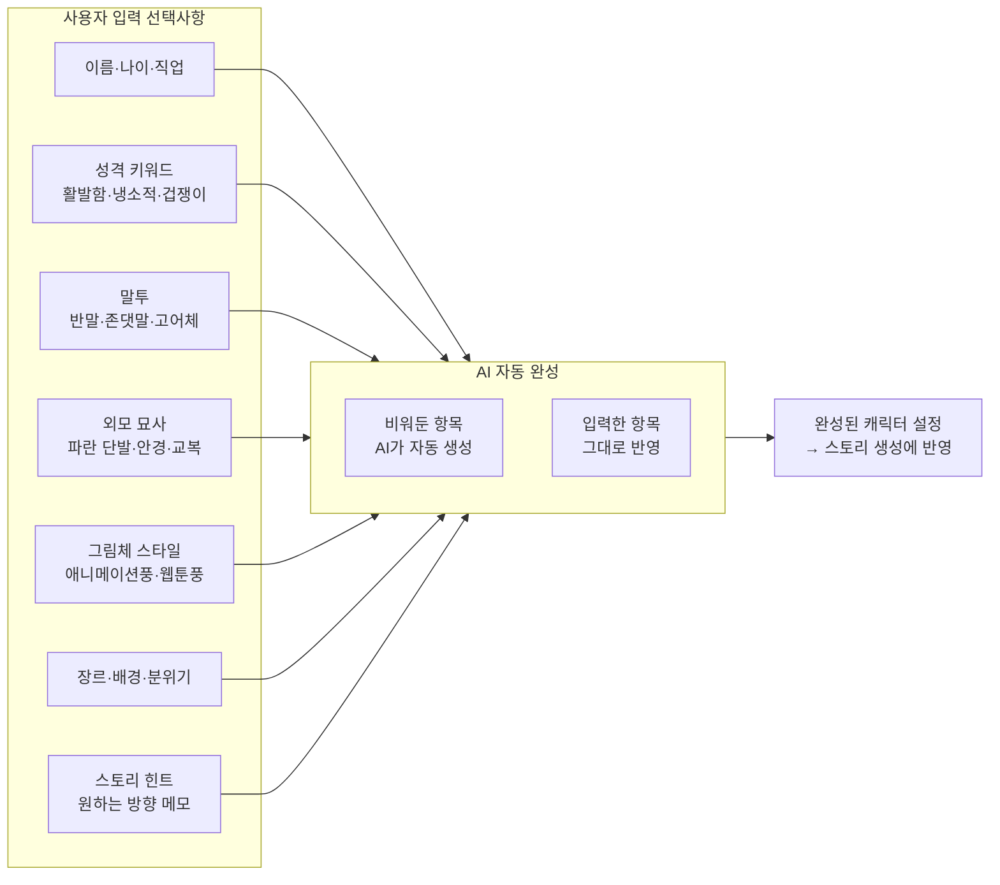
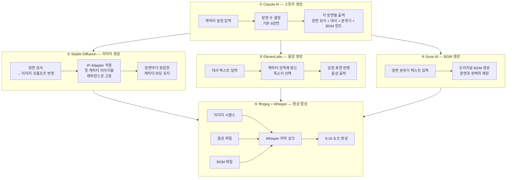
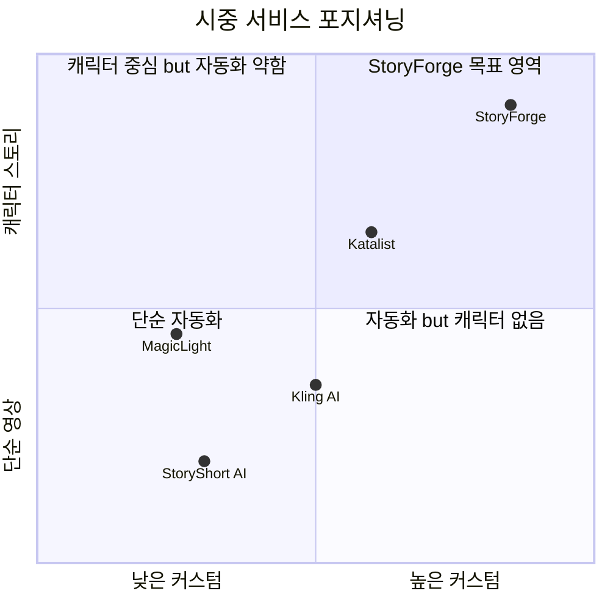
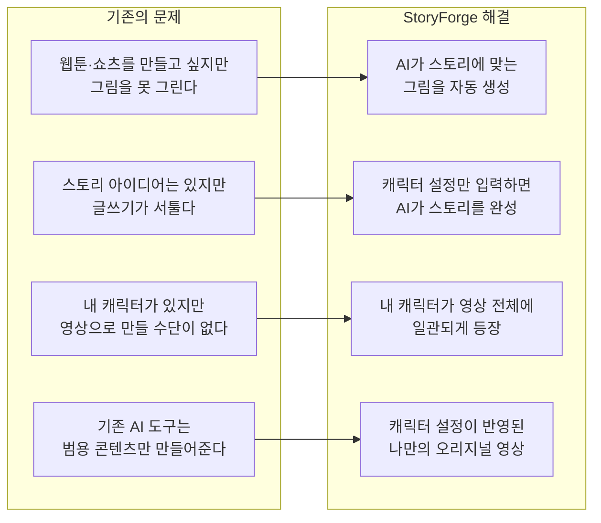
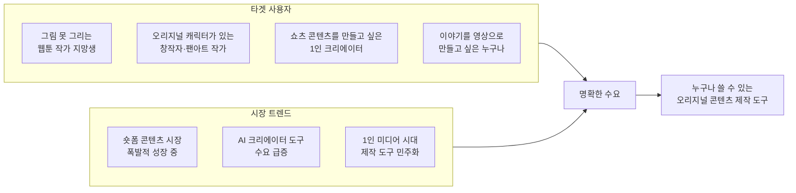
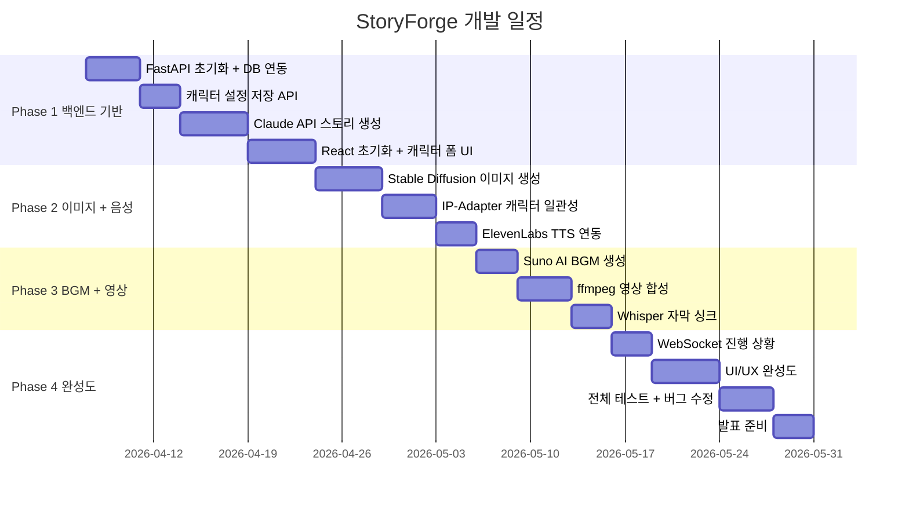

# StoryForge
> **아이디어만 있으면 누구나 자기만의 스토리 쇼츠를 만든다**

캐릭터 설정 하나로 스토리·이미지·음성·BGM이 모두 AI로 생성되어 쇼츠 한 편이 완성되는 웹 애플리케이션.
그림을 못 그려도, 글쓰기가 서툴러도, 음악을 몰라도 — 내 캐릭터가 살아 움직이는 영상을 만들 수 있다.

---

## 핵심 한 줄 요약

> **"내가 만든 캐릭터의 성격과 말투가 AI 스토리에 반영되고, 그 캐릭터가 영상 전체에서 일관되게 등장한다"**

---

## 전체 작동 원리

---

## 캐릭터 설정 구조

사용자는 원하는 항목만 입력하면 된다. 비워두면 AI가 자동으로 채운다.

---

## AI 파이프라인 상세

---

## 기술 스택

| 분류 | 기술 | 역할 |
|------|------|------|
| 프론트엔드 | React + Vite | 웹 UI 전체 |
| 백엔드 | FastAPI (Python) | REST API 서버 |
| 스토리 생성 | Claude Sonnet API | 캐릭터 설정 반영 스토리·대사·장면 묘사 |
| 이미지 생성 | Stable Diffusion 3.5 | 장면별 이미지 생성 |
| 캐릭터 일관성 | IP-Adapter | 장면마다 동일한 캐릭터 외모 유지 |
| 음성 생성 | ElevenLabs | 캐릭터 성격별 AI 음성 |
| BGM 생성 | Suno AI | 장면 분위기 맞춤 오리지널 BGM |
| 영상 합성 | ffmpeg | 이미지+음성+BGM → 최종 영상 |
| 자막 | Whisper | 음성 타임스탬프 추출 → 자막 싱크 |
| DB | PostgreSQL | 캐릭터·프로젝트 저장 |

---

## 시중 서비스와의 차별점

### 경쟁 서비스 비교

### 기능별 비교표

| 기능 | StoryForge | StoryShort | Katalist | MagicLight |
|------|:----------:|:----------:|:--------:|:----------:|
| 오리지널 캐릭터 생성 | ✅ | ❌ | ⚠️ 부분 | ❌ |
| 캐릭터 성격→대사 반영 | ✅ | ❌ | ❌ | ❌ |
| 캐릭터 외모 일관성 유지 | ✅ IP-Adapter | ❌ | ✅ | ❌ |
| AI 스토리 자동 생성 | ✅ | ✅ | ❌ | ⚠️ 템플릿 |
| AI 음성 생성 | ✅ | ✅ ElevenLabs | ❌ | ✅ |
| AI BGM 생성 | ✅ Suno | ❌ | ❌ | ❌ |
| 완전 자동 + 커스텀 동시 | ✅ | ❌ | ❌ | ❌ |
| 모든 요소 AI 생성 | ✅ | ⚠️ | ❌ | ⚠️ |

> ✅ 지원 | ⚠️ 부분 지원 | ❌ 미지원

### StoryForge만의 핵심 차별점 3가지

**1. 캐릭터가 스토리를 만든다**
기존 서비스는 스토리를 만들고 거기에 이미지를 붙인다.
StoryForge는 캐릭터의 성격·말투·관계가 스토리 자체를 결정한다.
같은 "판타지 로맨스"여도 캐릭터 설정에 따라 완전히 다른 이야기가 나온다.

**2. 장면마다 같은 캐릭터가 나온다**
기존 AI 영상 서비스의 가장 큰 문제는 "캐릭터 드리프트" — 장면마다 캐릭터 얼굴이 달라지는 것.
StoryForge는 IP-Adapter로 첫 생성 이미지를 레퍼런스로 고정해서 이 문제를 해결한다.

**3. 완전 자동이거나 완전 커스텀이거나**
기존 서비스는 완전 자동(선택지 없음) 또는 직접 다 설정하는 방식 둘 중 하나.
StoryForge는 원하는 것만 입력하고 나머지는 AI가 채우는 유연한 구조를 제공한다.

---

## StoryForge가 해결하는 문제

---

## 수요 및 시장성

---

## 개발 로드맵

---

## 발표 시연 시나리오

1. **캐릭터 설정 입력** — "겁쟁이 고등학생 마법사, 파란 단발, 존댓말 사용, 공포 코믹 장르" 입력
2. **AI 스토리 생성** — Claude가 캐릭터 성격이 반영된 8장면 스토리 + 대사 자동 생성
3. **이미지 생성** — 각 장면에 맞는 이미지 생성, 모든 장면에서 동일한 캐릭터 등장 확인
4. **음성 + BGM** — 캐릭터 말투에 맞는 AI 음성, 공포 코믹 분위기 BGM 자동 생성
5. **쇼츠 완성** — 영상 합성 후 자막 포함 쇼츠 다운로드

> 버튼 몇 번으로 오리지널 캐릭터의 쇼츠가 완성된다.
